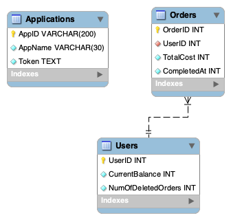

# Middleware API for managing customers' loyalty points
### 1. Motivation
We might assume the team is developing a middleware microservice to maintatin customers' loyalty program points.
The Customers' Loyalty Points API (CLP API) communicates with other microservices, encapsulating the loyalty program logic.
CL API will maintain various access levels for different application, which will enhance application's security.
### 2. Supported functionality
1. Admin application is initialised in the DB (has access level `MasterApp`).
2. Admin application can create an application and specify access level (`Can_Read` | `Can_Modify_Orders`).
3. When application is created, the CLP API issues AppID and a token to authenticate the application later.
4. Applications with `Can_Read` access level can (Priority - 2):
   1. Get the customer's balance by sending a POST request with the only field:
      1. UserID - int
5. Applications with `Can_Modify_Orders` access level can (Priority - 1):
   1. Insert an order into order history by sending a POST request and modify current loyalty program balance with the following structure:
      1. UserID - int
      2. OrderID - int
      3. TotalCost - int
      4. CompletedAt - int (timestamp)
   2. Delete an order by sending a DELETE request to with the following structure:
      5. UserID - int
      6. OrderID - int
6. Application with `MasterApp` access level can (Priority - 0):
   1. Create a new application by sending a POST request with the following structure:
      1. ApplicationName - str (30 characters)
      2. AccessLevel - str (Enum[`Can_Read`, `Can_Modify_Orders`])
   2. Update application's access level by sending a PUT request with:
      1. AppID - str (returned when created)
      2. NewAccessLevel - str (Enum[`Can_Read`, `Can_Modify_Orders`])
   3. Delete the application by sending a DELETE request with:
      1. AppID - str (returned when created)
### 3. Microservice logic.
Microservice processes information about the order and depending on the TotalCost adds some number of points to the customer's balance.
```math
NewPoints = TotalCost * 0.05 * NormalCoef, where 
NormalCoef = min(1, 1.2 - (NumOfDeletedOrders / (TotalNumOfOrders + 1)))
```
Deleted order means that the customer returned the item, thus we penalise customers who return orders too often.
However, penalty starts only if more then 20% of orders were returned.
### 4. Database Design.


### 5. Suggested Stack.
1. FastAPI
2. SQLAlchemy (Postgres)
3. Pytest
4. Docker
