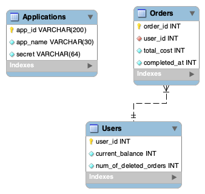

# Middleware API for managing customers' loyalty points
### 1. Motivation
We are developing a middleware microservice, the Customers' Loyalty Points API (CLP API), to enhance customer retention and loyalty in the business strategy. This API serves as a centralized system to manage loyalty points.
It communicates with other microservices, encapsulating the loyalty program logic.
CLP API maintains various access levels for different applications, which enhances application's security.
### 2. Supported functionality
1. Admin application is initialised in the DB. It has access level `MasterApp`.
2. Admin application can create applications (which represent other microservices) with specific access levels: `Can_Read`, `Can_Modify_Orders`.
3. On creation, applications receive an AppID and a token for future authentication.
4. Applications with `Can_Read` access level can:
   1. Request the customer's balance by sending a GET request with the URL parameter:
      1. user_id - int
5. Applications with `Can_Modify_Orders` access level can:
   1. Insert an order into order history by sending a POST request and modify current loyalty program balance with the following structure:
      1. user_id - int
      2. order_id - int
      3. total_cost - int
      4. completed_at - int (timestamp)
   2. Delete an order by sending a DELETE request with the following structure:
      1. order_id - int
6. Application with `MasterApp` access level can:
   1. Create a new application by sending a POST request with the following structure:
      1. application_name - str (30 characters)
      2. access_level - Enum[`Can_Read`, `Can_Modify_Orders`]
   2. Update application's access level by sending a PUT request with:
      1. app_id - str (returned when created)
      2. new_access_level - Enum[`Can_Read`, `Can_Modify_Orders`]
   3. Delete the application by sending a DELETE request with:
      1. app_id - str (returned when created)
### 3. Microservice logic
Microservice processes information about the order and depending on the TotalCost adds some number of points to the customer's balance.
```math
NewPoints = TotalCost * 0.05 * NormalCoef, where 
NormalCoef = min(1, 1.2 - (NumOfDeletedOrders / (TotalNumOfOrders + 1)))
```
Deleted order means that the customer returned the item, thus we penalise customers who return orders too often.
However, penalty starts only if more than 20% of orders were returned.
### 4. Database Design


### 5. Suggested Stack
1. FastAPI
2. SQLAlchemy (Postgres)
3. Pytest
4. Docker
